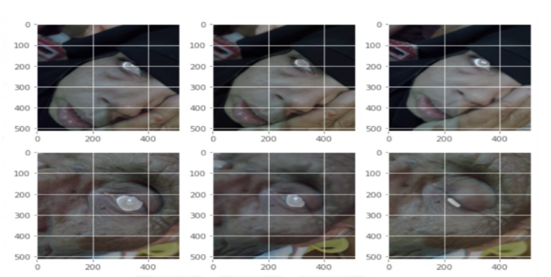

# Cataract Detection via Near Infrared Images

## Overview

This project focuses on detecting cataracts using near infrared images, providing an efficient and accurate diagnosis of this common eye condition that can lead to impaired vision. The project combines image segmentation and classification techniques to identify and classify cataract regions in the images.

## Approaches Used

### Segmentation with U-Net and DeepLabV3

Two advanced segmentation techniques, U-Net and DeepLabV3, are implemented to segment the cataract regions within the near infrared images. These architectures excel in capturing detailed object boundaries and features, allowing for accurate region identification.

#### U-Net

#### DeepLabV3

### Classification using ResNet50

The ResNet50 architecture is employed for image classification. It distinguishes between cataract-affected regions and healthy regions based on extracted features. This step provides a final diagnosis by determining whether a given region contains cataracts.

## Tech Stack

- TensorFlow: A powerful deep learning framework for model development, training, and deployment.
- OpenCV: An open-source computer vision library used for image processing and analysis.
- Image Segmentation: The process of dividing images into meaningful parts for detailed analysis.
- Image Classification: Assigning labels to images based on content.
- U-Net and DeepLabV3: Neural network architectures specialized in segmentation.
- ResNet50: A widely-used architecture for image classification.

## Impact

By combining advanced image segmentation and classification techniques, this project aims to provide an automated solution for early cataract detection. Detecting cataracts at an early stage can lead to timely intervention and better outcomes for individuals with impaired vision.

## Results

